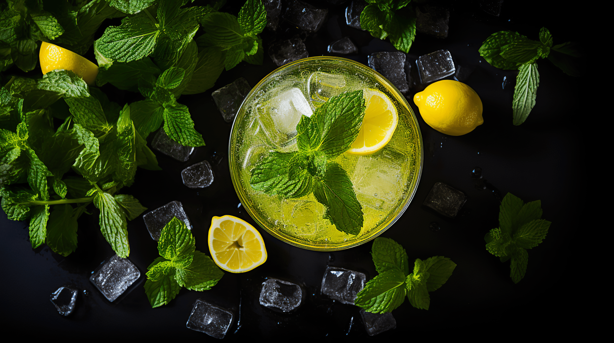

# Cocktail selector

## Find Your Perfect Mix!

Welcome to the Cocktail Selector, an R package and Shiny app designed to help cocktail lovers and bartenders discover new and exciting cocktail recipes. Our intuitive tool simplifies the process of finding cocktails based on your preferred alcohol and ingredients.

### Why Cocktail Selector?

Choosing the right cocktail from countless options can be overwhelming. The Cocktail Selector is here to make that choice easier. Whether you're hosting a party, exploring the world of mixology, or simply feeling adventurous, our package provides a user-friendly interface to explore and discover up to 600 cocktail recipes that match to your tastes.

### Features

- **Select by Base**: Choose cocktails based on their base spirit.
- **Filter by Taste**: Find cocktails that match your desired flavor profile. (max: 2 ingredients)
- **Random Selector**: Not sure what you want? Let the 'Surprise Me' feature decide!
