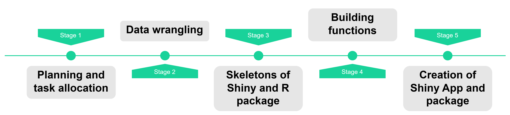
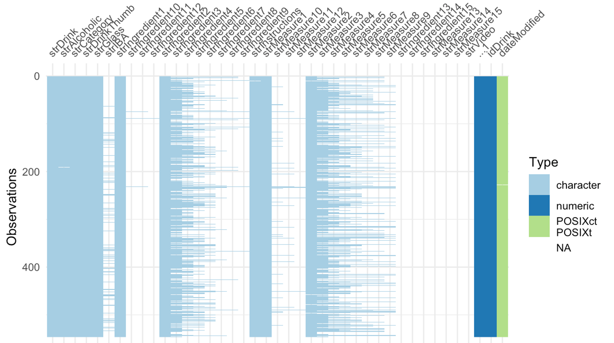

```{r setup, include=FALSE}
options(htmltools.dir.version = FALSE)
knitr::opts_chunk$set(
  fig.width=9, fig.height=3.5, fig.retina=3,
  out.width = "100%",
  cache = FALSE,
  echo = TRUE,
  message = FALSE, 
  warning = FALSE,
  hiline = TRUE
)
```

```{r xaringan-themer, include=FALSE, warning=FALSE}
library(xaringanthemer)
style_duo_accent(
  primary_color = "#78c1ad",
  inverse_header_color = "#FFFFFF",
  title_slide_text_color = "#FFFFFF"
)
```

```{r Packages, echo=FALSE}
library(knitr)
library(kableExtra)
library(gridExtra)
library(here)
```

## Your Evening, Your Elixir

**Imagine:**
  - An evening unfolds, and the craving for a delightful drink sets in.
  - The world of mixology sprawls before you, full of possibilities but also overwhelming.

**Our Solution:**
  - A tool born from the fusion of technology and mixology.
  - Simplifying your quest for the perfect evening elixir.

**The Scene Unfolds:**
  - An interactive platform designed to simplify your journey into the world of cocktails.
  - Choose your ingredients, and let the tool curate tailored cocktails.
  - No expertise needed; become your own mixologist effortlessly.

---
## The Vision Behind Our Mixological Innovation

**Igniting the Project:**
  - Fueled by a burning desire to fuse technology seamlessly with mixology.
  - Our mission: Craft a practical tool that effortlessly empowers users to navigate the intricate world of cocktails.

**Practical Prowess:**
  - We set out to develop a tool immediately applicable to enhance the mixology experience.
  - Guided by practicality, every decision aimed to ensure project feasibility within the given timeframe and leverage our R and Shiny expertise.

**A Learning Expedition:**
  - Beyond solving a problem, our project became a valuable learning journey.
  - Motivated by the prospect of delving into R and Shiny, we embraced the challenge


---

## Logic Flow

<div style="text-align: center; margin-top: 10%;">

  

---

## Overview of the drinks dataset

- Drink names: a variety of drink names, indicating diverse beverages
- Alcoholic content: specifies whether a drink is alcoholic or non-alcoholic
- Image URLs: ULRs to images of the drinks
- Ingredients and measures: detailed lists of ingredients and measures
- Over 40 columns and over 500 cocktails offered
- Preparation steps for creating a cocktail

<div style="text-align: center">
 


---

## Understanding ingredients and measurements structure


1. Dynamic Column Creation: Starts with the first cocktail; columns added as per ingredients.
2. Sequential Addition: New cocktails fill existing columns if they have equal or fewer ingredients.
3. Expansion for More Ingredients: Additional columns created for cocktails with more ingredients.
4. Parallel Structure for Measurements: 15 corresponding columns for measurements align with ingredients.
5. Cumulative Column Growth: Reflects the cocktail with the highest number of ingredients.
6. Flexible and Comprehensive: Ensures accommodation of cocktails with varying ingredients.

```{r, echo=FALSE}
# Creating a data frame
cocktail_data <- data.frame(
  Cocktail = c("Cocktail 1", "Cocktail 2", "Cocktail 3"),
  Ingredient_1 = c("Lime", "Raspberry", "Cranberry"),
  Ingredient_2 = c("Vodka", "Beer", "Orange Juice"),
  Ingredient_3 = c("N/A", "N/A", "Rum")) %>% 
  kable(format = "html", 
      col.names = c("Cocktail", "Ingredient 1", "Ingredient 2", "Ingredient 3"),
      align = "c") %>%
  kable_styling("striped", full_width = FALSE) 
cocktail_data
```
---

## Data wrangling: encoding

- Hot encoding of ingredients: transitioned from 15 columns containing ingredients without a specific order to one column per ingredient
- Encoding method: used the measurement as the value when an ingredient is present, NA otherwise
- Handling diverse measurements: kept measurements in their original string format

```{r, echo=FALSE}
# Creating a data frame
cocktail_data2 <- data.frame(
  Cocktail = c("Cocktail 1", "Cocktail 2"),
  Ingredient_1 = c("Lime", "Grape Juice"),
  Ingredient_2 = c("Vodka", "Beer")) %>% 
  kbl(format = "html", 
      col.names = c("Cocktail", "Ingredient 1", "Ingredient 2"),
      align = "c") %>%
  kable_styling("striped", full_width = FALSE, position = "left")
cocktail_data2
```

```{r, echo=FALSE}
# Creating a data frame
cocktail_data3 <- data.frame(
  Cocktail = c("Cocktail 1", "Cocktail 2"),
  Measure_1 = c("1/2", "50 ml"),
  Measure_2 = c("1 1/3 cup", "0.7 oz")) %>% 
  kable(format = "html", 
      col.names = c("Cocktail", "Measure 1", "Measure 2"),
      align = "c") %>%
  kable_styling("striped", full_width = FALSE, position = "left")
cocktail_data3
```

```{r, echo=FALSE}
# Creating a data frame
cocktail_data4 <- data.frame(
  Cocktail = c("Cocktail 1", "Cocktail 2"),
  Lime = c("1/2", "N/A"),
  Grape_juice = c("N/A", "50 ml"),
  Vodka = c("1 1/3 cup", "N/A"),
  Beer = c("N/A", "0.7 oz"))

cocktail_data4 %>% 
  kable(format = "html", 
      col.names = c("Cocktail", "Lime", "Grape Juice", "Vodka", "Beer"),
      align = "c") %>%
  kable_styling("striped", full_width = FALSE)
```

---
## Data wrangling: unit homogenization

- Measurements are Initially encountered in various formats like ‘1 ½ oz', '1/2 cup', '0.5', ‘1 ml' etc.
- Each number is accompanied by a measurement unit, with over 90 different unit options
- Homogenization to Decimals/Entire number: Standardized all measurements to decimal or entire format for consistency
- We do this step to make it easier to convert units using the R package, enabling data manipulation

```{r, echo=FALSE}
cocktail_data4 %>% 
  kable(format = "html", 
      col.names = c("Cocktail", "Lime", "Grape Juice", "Vodka", "Beer"),
      align = "c") %>%
  kable_styling("striped", full_width = FALSE, position="center")

```
<br>
```{r, echo=FALSE}
# Creating a data frame
cocktail_data5 <- data.frame(
  Cocktail = c("Cocktail 1", "Cocktail 2"),
  Lime = c("0.5", "N/A"),
  Grape_juice = c("N/A", "50 ml"),
  Vodka = c("1.33 cup", "N/A"),
  Beer = c("N/A", "0.7 oz")
)

# Displaying the table using kable with formatting
kable(cocktail_data5, format = "html", 
      col.names = c("Cocktail", "Lime", "Grape Juice", "Vodka", "Beer"),
      align = "c") %>%
  kable_styling("striped", full_width = FALSE,position="center")
```

---
## Package functions

Our package contains a total of 8 functions</b>:

- <b>3 internal functions</b>
  - renderSideIngredientUI
  - updateSideIngredient
  - welcomeMessage
- <b>5 external functions that are exported</b>
   - cocktailApp
   - filterCocktails
   - ingredientsTable
   - convertUnits
   - surpriseMe
   
---
## renderSideIngredientUI
Renders the 3 dropdown menus dynamically
```{r}
renderSideIngredientUI <- function(input, output) {
  output$sideIngredient1Dropdown <- renderUI({
    if (!is.na(input$ingredient1) && input$ingredient1 != "" && input$ingredient1 != "Choose") {
      selectInput("ingredient2", "Side Ingredient 1", choices = c("Choose" = ""), selected = "Choose", multiple = FALSE)
    }
  })

  output$sideIngredient2Dropdown <- renderUI({
    if (isTruthy(input$ingredient2) && input$ingredient2 != "Choose") {
      selectInput("ingredient3", "Side Ingredient 2", choices = c("Choose" = ""), selected = "Choose", multiple = FALSE)
    } else {
      return(NULL)  # Return NULL if the condition is not met
    }
  })
}
```

---
## updateSideIngredients
Updates which ingredients are shown in the dropdowns depending on previous selection.
```{r}
updateSideIngredients <- function(input, session, cocktails) {
  observeEvent(input$ingredient1, {
    if (input$ingredient1 != "" && input$ingredient1 != "Choose") {
      compatible_cocktails <- cocktails[!is.na(cocktails[[input$ingredient1]]), ]
      ingredient_columns <- colnames(cocktails)[7:ncol(cocktails)]
      non_na_ingredients <- ingredient_columns[colSums(!is.na(compatible_cocktails[ingredient_columns])) > 0]
      non_na_ingredients <- setdiff(non_na_ingredients, input$ingredient1)
      updateSelectInput(session, "ingredient2", choices = c("Choose" = "", sort(non_na_ingredients)))
    } else {
      updateSelectInput(session, "ingredient2", choices = c("Choose" = ""))
    }
  })

  observeEvent(input$ingredient2, {
    if (input$ingredient2 != "" && input$ingredient2 != "Choose") {
      compatible_cocktails <- cocktails[!is.na(cocktails[[input$ingredient1]]) & !is.na(cocktails[[input$ingredient2]]), ]
      ingredient_columns <- colnames(cocktails)[7:ncol(cocktails)]
      non_na_ingredients <- ingredient_columns[colSums(!is.na(compatible_cocktails[ingredient_columns])) > 0]
      non_na_ingredients <- setdiff(non_na_ingredients, c(input$ingredient1, input$ingredient2))
      updateSelectInput(session, "ingredient3", choices = c("Choose" = "", sort(non_na_ingredients)))
    } else {
      updateSelectInput(session, "ingredient3", choices = c("Choose" = ""))
    }
  })
}
```

---
## welcomeMessage
Shows welcome message popup when launching the app
```{r}
welcomeMessage <- function() {
  message <- HTML(paste0("Welcome to the Cocktail Explorer App!", '<br/>','<br/>',
                   "Select your favorite alcohol and two ingredients, and let us surprise you with the best matching cocktails.", '<br/>',
                   "Feeling adventurous today? Click on the Surprise Me button, and we'll pick the best drinks for you!", '<br/>', '<br/>',
                   "You can also go to the instructions tab to learn more about the different features of the app.")
                  )
  return(message)
}
```

---
## cocktaiApp
Launched shiny app
```{r}
cocktailApp <- function(){
  #ui
  #server
  #run the application
  shinyApp(ui = ui, server = server)
}
```

---
## filterCocktails
Takes the selection from the dropdowns and filters the cocktails dataframe
```{r}
filterCocktails <- function(df, alcohol = NULL, ing1 = NULL, ing2 = NULL){
  result <- df
    if (!is.null(alcohol) && alcohol!="") {
      result <- result[!is.na(result[[alcohol]]), ]
    }
    if (!is.null(ing1) && ing1!="") {
      result <- result[!is.na(result[[ing1]]), ]
    }
    if (!is.null(ing2) && ing2!="") {
      result <- result[!is.na(result[[ing2]]), ]
    }
  return(result)
}
```

---
## ingredientsTable
Returns a kable of ingredients and corresponding quantities for a specific cocktail
```{r}
ingredientsTable <- function(df = cocktails, selected_cocktail) {
  # Check if the selected cocktail is not in the df
  if(!(selected_cocktail %in% df$Name)){
    stop("This cocktail is not in the dataframe")
  }
  #creating table
  ing_table <- df %>%
    dplyr::filter(Name == selected_cocktail) %>%
    dplyr::select(-c(Type, Category, Picture, Glass, Recipe)) %>%
    tidyr::pivot_longer(-Name, names_to = "Ingredient", values_to = "Quantity", values_drop_na = TRUE) %>%
    dplyr::select(-Name) %>%
    kableExtra::kbl() %>%
    kableExtra::kable_styling("striped")

  return(ing_table)
}
```

---
## convertUnits
```{r}
convertUnits <- function(data, conversion_direction) {
  if (conversion_direction == "imperial_to_international") {
    for (i in 1:nrow(data)) {
      for (j in 7:ncol(data)) {
        if (!is.na(data[i, j])) {
          parts <- stringr::str_match(data[i, j], "([0-9.]+)\\s*([a-zA-Z]+)")
          if (!is.null(parts) && length(parts) == 3 && parts[3] %in% imperial_units) {
            value <- as.numeric(parts[2])
            unit <- parts[3]
            if (unit %in% c("oz", "gal", "qt", "pint", "quart")) {
              # Convert volume to ml
              converted_value <- round(value * imperial_to_international[which(imperial_units == unit)], -1)
              new_unit <- "ml"
            } else if (unit %in% c("lb")) {
              # Convert mass to kg
              converted_value <- round(value * imperial_to_international[which(imperial_units == "lb")], 1)
              new_unit <- "kg"
            } else if (unit %in% c("inch")) {
              # Convert distance to cm
              converted_value <- round(value * imperial_to_international[which(imperial_units == "inch")], 1)
              new_unit <- "cm"
            } else {
              # Keep the original value if not in the specified units
              converted_value <- value
              new_unit <- unit
            }
            # Update the dataset
            data[i, j] <- paste(converted_value, new_unit)
          }
        }
      }
    }
  }
}
```

---
## surpriseMe
Returns a random row within the cocktails dataframe
```{r}
surpriseMe <- function(){
  return(cocktails[sample(nrow(cocktails), 1), ])
}
```

---
## How does the shiny app look like?
```{r echo=FALSE}
knitr::include_graphics(here("slides/fig/whole_app.png"))
```

---
## Main features
We have 4 main functionalities in shiny:
1. Filtering based on ingredients selected &rarr; filterCocktails()
2. Surprise me button &rarr; shiny + surpriseMe()
3. Measurement unit transformation &rarr; convertUnits()
4. See details for a selected cocktail &rarr; shiny + ingredientsTable()

---
## Cocktail List
```{r echo=FALSE}
knitr::include_graphics(here("slides/fig/filtering_markup.png"))
```

---
## Cocktail Details

```{r echo=FALSE, fig.height=5}
knitr::include_graphics(here("slides/fig/details.png"))
```

---
class: center, middle
## Thank you for your attention! 


