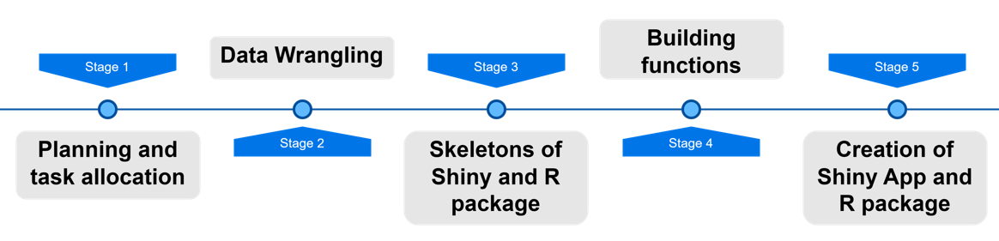

```{r setup, include=FALSE}
options(htmltools.dir.version = FALSE)
knitr::opts_chunk$set(
  fig.width=9, fig.height=3.5, fig.retina=3,
  out.width = "100%",
  cache = FALSE,
  echo = TRUE,
  message = FALSE, 
  warning = FALSE,
  hiline = TRUE
)
```

```{r xaringan-themer, include=FALSE, warning=FALSE}
library(xaringanthemer)
style_duo_accent(
  primary_color = "#808080",
  inverse_header_color = "#FFFFFF"
)
```

# Contents

**Introduction**

Why do we use R and Shiny and what is the power behind them? What was our vision and motivation?

**Methodology**

How did we structure our work? What were the steps?

**Results**

... to fill out

**Demonstration & Conclusion**

... to fill out

---

## The Power of R and Shiny

- The world of mixology is vast, with countless cocktail possibilities. As aspiring programmers, we saw an opportunity to blend technology with mixology to create a unique and interactive experience.

- **R Language:**
  - Renowned for its statistical computing and data visualization capabilities.
  - Widely used in academia, industry, and research.

- **Shiny App:**
  - A web application framework for R.
  - Bridges the gap between data analysis and interactive web applications.

---

## Why R and Shiny?

- **R's Ubiquity:**
  - Over 2 million users globally
  - 70% of data scientists prefer R for data analysis

- **Shiny's Impact:**
  - Rapidly gaining popularity in the data science community.
  - 350,000+ Shiny apps deployed

- **Numeric Evidence:**
  - **% Growth in R Usage:**
    Up by 40% in the last three years
    
  - **Shiny's Adoption:**
    60% increase in Shiny usage in the past year

---

## Our Vision

- **The Idea:**
  - Empowering users to discover cocktails based on chosen ingredients.

- **Key Features:**
  - Explore a database of 600 curated cocktails.
  - Search for cocktails based on chosen ingredients.
  - Get personalized recommendations.

---

## Project Structure

1. **Data Preparation:**
   - Load and clean the cocktail database.
   - Structure data for efficient querying.

2. **Function Building:**
   - Define functions for search, recommendation, and data processing.
   - Utilize packages like `dplyr`, `shiny`, and others.

---
## Logic Flow





---

## Shiny App

---

## R Package

---

## Demonstration

---

## Conclusion

---
class: center, middle

## Thank you for your attention! 


